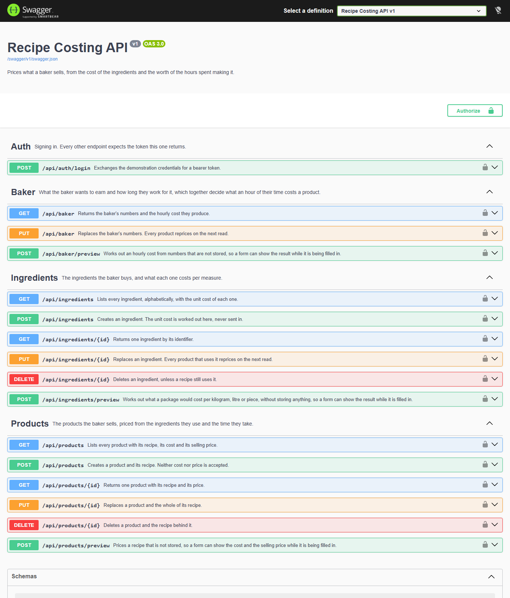
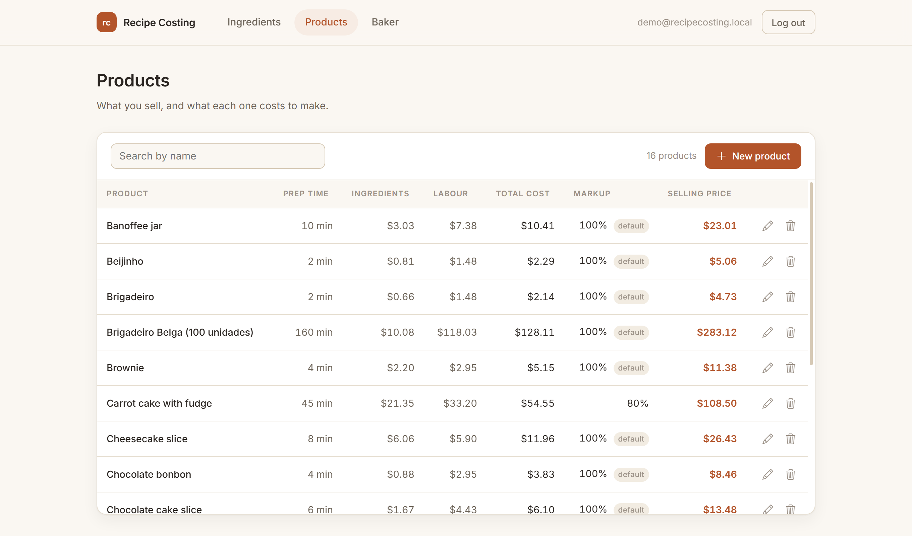

# Recipe Costing

[](https://github.com/LeoLopesDev82/RecipeCosting/actions/workflows/ci.yml)

Pricing for a home bakery: what an ingredient costs per kilogram, what an hour of the
baker's own time is worth, and what a product has to sell for once both are counted.



## Why it exists

My wife is a confectioner. Like most people in the trade, she priced her work on a
spreadsheet — one tab for ingredients, another for recipes, formulas copied down by hand
and re-copied whenever the supermarket changed a price. It worked until it didn't: a can
of condensed milk goes up, and every cell that mentions it is now wrong, silently.

Two things were always missing from the spreadsheet, and they are the ones that decide
whether the month closes in the black:

- **Her own time.** A brigadeiro costs about seven cents of condensed milk. The two
  minutes it takes to roll it cost about a dollar and a half. The spreadsheet counted the
  first and ignored the second.
- **The fees.** Markup goes on top of the cost; the card operator and the tax come off the
  selling price. Adding both as one percentage feels right and quietly eats the margin.

So the answer was an application where the price is not a number someone typed once, but
the result of what things cost today.

## The idea behind the model

**No cost and no price are ever stored.** The database keeps what the baker knows: the
package she bought and what she paid for it, the ingredients that go into each product and
how much of each, the hours she works and what she wants to earn. Everything else is
worked out on every read.

Chocolate goes up thirty per cent, she edits one ingredient, and every product that uses
it reprices — with nothing to recalculate and nothing to migrate.

That single decision shapes the rest of the API:

- A product's `markup` is **nullable**. Null means it follows the baker's default, so
  raising the default raises the products that never asked for a markup of their own,
  and leaves alone the ones that did.
- Deleting an ingredient a recipe still uses answers **409 Conflict** with an explanation,
  rather than leaving a foreign key to fail or silently taking the cost out from under a
  product.
- Every screen that computes while you type has a **preview endpoint** behind it —
  `/api/ingredients/preview`, `/api/baker/preview`, `/api/products/preview`. They price
  something that is not stored, so the browser can show a live result without owning a
  copy of the arithmetic. **There is no costing rule in the front end.**

## The arithmetic, in three helpers

The rules live in pure functions with no database and no HTTP, which is why they are the
part covered by tests.

| Helper | Answers |
| --- | --- |
| `UnitCostHelper` | A package of 395 g for $7.49 costs **$18.96/kg**. Grams are costed per kilogram, millilitres per litre, pieces per piece. |
| `HourlyCostHelper` | Wanting $4,000 a month, working 6 h a day, 5 days a week, gives 129.9 hours and **$30.79 of labour per hour**; the fixed costs add **$9.62 of overhead**. |
| `ProductCostHelper` | Ingredients + preparation time at that hourly cost, markup on top, then the card fee and the tax added back, because they come off the selling price. |

That last one is the distinction the spreadsheet never made:

```
price = cost × (1 + markup)  ÷  (1 − fees)
```

A product arrives priced. Nothing in this response was stored: every line was multiplied
by what its ingredient costs today, the preparation time was charged at the baker's
hourly cost, and the markup and the fees were put on top.

```jsonc
// GET /api/products/1
{
  "id": 1,
  "name": "Brigadeiro",
  "prepMinutes": 2,
  "markup": null,                       // follows the bakery default
  "lines": [
    { "ingredientName": "Condensed milk",      "quantity": 18, "unit": "g", "cost": 0.34 },
    { "ingredientName": "Cocoa powder",        "quantity": 2,  "unit": "g", "cost": 0.15 },
    { "ingredientName": "Unsalted butter",     "quantity": 1,  "unit": "g", "cost": 0.06 },
    { "ingredientName": "Chocolate sprinkles", "quantity": 4,  "unit": "g", "cost": 0.11 }
  ],
  "cost": {
    "ingredients": 0.66,
    "labour": 1.48,                     // two minutes of the baker's time
    "total": 2.14,
    "markup": 100,
    "inherited": true,
    "price": 4.73
  }
}
```

Seven cents of condensed milk, and a dollar and a half of the time it takes to roll it.
That is the number the spreadsheet never counted.

Failure is answered as carefully as success:

```jsonc
// DELETE /api/ingredients/1  ->  409 Conflict
{
  "title": "The ingredient is in use.",
  "status": 409,
  "detail": "A product still lists this ingredient. Remove it from the recipes first."
}
```

## Built with

- **ASP.NET Core 9** — controllers, JWT bearer authentication, Swagger generated from the
  XML documentation the build produces
- **Entity Framework Core 9** with **PostgreSQL** (Npgsql) — migrations create the schema
  and seed a working pantry, so a fresh database is useful the moment it exists
- **xUnit** — 25 tests over the costing rules and 5 that start the application and call
  it over HTTP; the client has 7 of its own over the one piece of logic it still owns
- **Angular 22** — standalone components, signals, reactive forms; a client, not the point



The columns are the argument: what the ingredients cost, what the time cost, and what the
product has to sell for. The client computed none of them.

## Running it

You need the [.NET 9 SDK](https://dotnet.microsoft.com/download) and a PostgreSQL server.

**1. Local settings.** Copy the example and fill it in:

```bash
cp src/api/RecipeCosting.Api/appsettings.Development.example.json \
   src/api/RecipeCosting.Api/appsettings.Development.json
```

Put your connection string in it and a signing key of at least 32 characters. The
repository never carries either, and the API refuses to start without a key rather than
signing tokens with a blank string. User secrets and the `Auth__SigningKey` environment
variable work just as well.

**2. Create the database.**

```bash
dotnet ef database update --project src/api/RecipeCosting.Api
```

This creates the three tables and seeds 35 ingredients, 15 products with their recipes,
and the baker's settings.

**3. Run the API.**

```bash
dotnet run --project src/api/RecipeCosting.Api --launch-profile https
```

Swagger opens at `https://localhost:7137/swagger`. Sign in through `POST /api/auth/login`
with `demo@recipecosting.local` / `demo1234`, paste the token into the **Authorize**
button, and every other endpoint answers.

**4. Run the front end**, if you want the screens:

```bash
npm --prefix src/web install
npm --prefix src/web start
```

It expects the API on `https://localhost:7137` and serves at `http://localhost:4200`.

## Tests

```bash
dotnet test
```

Thirty of them. The twenty-five that matter most need no database and no web server,
because the rules do not, and they read as statements about the domain rather than about
the code:

```
Half_a_cent_rounds_away_from_zero_so_the_baker_is_not_short
A_product_without_a_markup_of_its_own_follows_the_bakery
The_fees_are_added_back_because_they_come_off_the_selling_price
The_total_is_rounded_once_at_the_end_and_not_summed_from_rounded_parts
A_line_whose_ingredient_is_gone_is_left_out_rather_than_priced_at_nothing
```

The last two pin down bugs that were found and fixed.

Five more start the whole application over an in-memory database and call it over HTTP,
covering what a unit test cannot reach: every endpoint refuses a request with no token, an
ingredient a recipe still uses is kept and the reason given, a recipe cannot name an
ingredient that is not in the pantry, and — the one that guards the whole idea — doubling
the price of an ingredient raises the price of every product that uses it.

## The endpoints

Sixteen, all but the first requiring a bearer token.

| | | |
| --- | --- | --- |
| `POST` | `/api/auth/login` | Exchanges the demonstration credentials for a token |
| `GET` `POST` | `/api/ingredients` | List, create |
| `GET` `PUT` `DELETE` | `/api/ingredients/{id}` | Read, replace, delete — **409** when a recipe still uses it |
| `POST` | `/api/ingredients/preview` | Unit cost of a package that is not stored |
| `GET` `PUT` | `/api/baker` | The single row of settings, with the hourly cost it produces |
| `POST` | `/api/baker/preview` | Hourly cost of a routine that is not stored |
| `GET` `POST` | `/api/products` | List priced, create |
| `GET` `PUT` `DELETE` | `/api/products/{id}` | Read, replace the whole recipe, delete |
| `POST` | `/api/products/preview` | Cost and selling price of a recipe that is not stored |

Validation answers `400` with a problem document naming the field, including the rules
that span fields: the card fee and the tax cannot take the whole selling price, and the
same ingredient cannot appear twice in one recipe.

Anything unexpected answers `500` with a problem document that says only that the request
failed. The exception itself goes to the log, which is where the detail belongs.

`GET /health` answers without a token and reports whether the database is reachable.

## Layout

```
src/api/RecipeCosting.Api/
├── Controllers/          HTTP, status codes, nothing else
├── Services/             one folder per feature, interface beside implementation
├── Helpers/              the costing rules, and the wiring for Swagger and JWT
├── Models/               Entities, Requests, Responses, Enums, Settings, Results
└── Data/                 context, migrations, seed data

tests/RecipeCosting.Api.Tests/
src/web/                  Angular client
```

Four folders, no ceremony. At this size a domain layer and a repository over an ORM that
already is one would add indirection without adding an answer.

## What is deliberately not here

**There is no user table.** Sign-in checks a demonstration account held in configuration
and issues a JWT. Authentication is a commodity; the costing is the point, and inventing
a registration flow would only pad the repository.

Logging out is therefore client-side: the token is discarded, and it stays valid on the
server until it expires, as a stateless token does. Revocation needs a refresh token or a
denylist — a deliberate omission, not an oversight.
